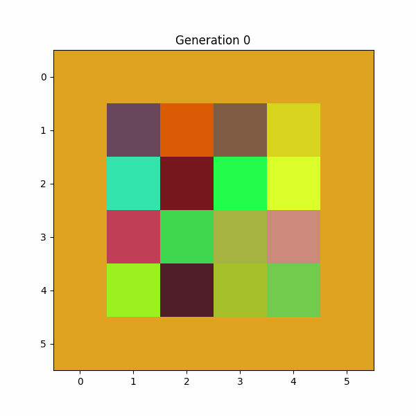

A genetic algorithm implementation for evolving image patterns to match target colors.



This module implements a genetic algorithm that evolves a grid of RGB color values
to match a target color. Each individual in the population represents a grid of
RGB values (e.g., 4x4 grid) where the average color aims to match the target.

The algorithm uses:

- Roulette wheel selection based on fitness
- Single-point crossover for reproduction
- Gaussian mutation on individual RGB values
- Elitism to preserve the best solution

Classes:

- GAConfig: Configuration parameters for the genetic algorithm
- ColorMatchingGA: Main genetic algorithm implementation
- Visualizer: Visualization tools for tracking evolution progress

Example:

```python
config = GAConfig(
    popsize=1000,
    target_value=np.array([222, 165, 33]) # Golden color
)
ga = ColorMatchingGA(config)
best_chromosomes, best_fitness = ga.evolve()
```
